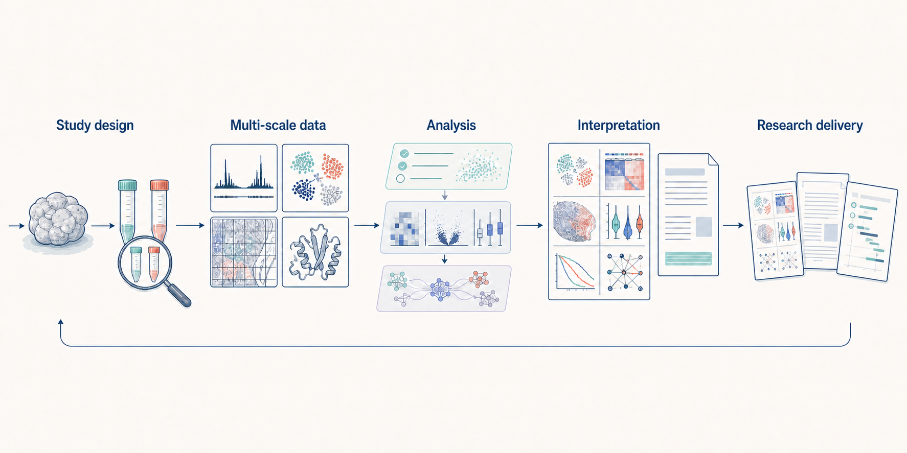

<h1 align="center">Biomed Workbench</h1>

<strong>One continuous path from research question to analysis and scientific communication</strong>

From omics, spatial and structural data to interpretation, research writing and delivery

<a href="README.md">中文</a> · <a href="README.en.md">English</a> ·
<a href="#start-a-project">Start a project</a> ·
<a href="docs/capabilities/README.md">All capabilities</a> ·
<a href="docs/releases/README.md">Release notes</a>

Conceptual illustration: study design and data at different scales enter one analytical process, where interpretation leads to scientific figures, research writing and a plan for subsequent work. The illustration does not show real experimental results.

Biomed Workbench is a research workbench for complex biomedical projects. Describe the scientific question, study design, available data and desired outcome in ordinary language; it organises the methods, analytical steps and deliverables around the research context instead of asking you to begin with a long list of tool names.

It can handle one well-defined analysis or coordinate a long-running project that combines several datasets, experiments and writing tasks. Workflows that are ready for the supplied inputs can proceed to execution and actual output review. When more data, software or scientific judgement is needed, the workbench explains why and identifies a practical next step.

## Start with a research question

| Understand the project | Complete the analysis | Build the research output |
| --- | --- | --- |
| Identify the system, experimental unit, groups, controls, data types, hypothesis and the question that actually needs an answer. | Choose a sufficient set of methods, connect dependent steps and use observed results to decide whether another analysis adds value. | Turn data, tables and figures into scientific interpretation, follow-up experiments, manuscript sections, proposals or presentations. |

You do not need to translate the project into software commands. The workbench distinguishes assays from targets, internal references, specificity treatments and normalisation strategies. It also recognises which analyses can proceed independently and which results must exist before the next step. For each question, it favours analyses that can change the scientific judgement rather than accumulating methods for their own sake.

## What research can it support?

### Data scales and research objects

| Research area | Supported work |
| --- | --- |
| [Bulk sequencing](docs/capabilities/bulk-sequencing-assays.md) | Inspect source reads, sample sheets, programs and reference resources before RNA abundance, RNA processing and alternative splicing; chromatin binding and accessibility; R-loop, protein–RNA binding, translation, nascent transcription, methylation and three-dimensional genome analysis |
| [Single-cell](docs/capabilities/single-cell-integration-reference-cross-species.md) | Quality control and annotation, batch and reference integration, multimodal analysis, trajectories and state transitions, regulatory networks, sample-aware inference and cross-species mapping |
| [Spatial](docs/capabilities/trajectory-spatial-complete-analysis.md) | Platform-aware input and quality control, tissue imaging and cell segmentation, spatial domains, deconvolution, reference mapping, spatial communication, slice alignment and three-dimensional tissue analysis |
| [Molecular and structural biology](docs/capabilities/molecular-and-structural.md) | Protein-interaction networks, AlphaFold result intake and interpretation, HADDOCK3 docking, structure comparison, binding assessment and structural-evidence figures |
| [Clinical and experimental research](docs/capabilities/clinical-and-experimental.md) | Cohorts, survival, biomarkers and quantitative assays, together with flow cytometry, qPCR, dose response, protein quantification, microbiology and animal-study design |
| [Quantitative image analysis](docs/capabilities/quantitative-imaging.md) | Image inspection, segmentation, colocalisation, object tracking, migration measurements and baseline registration, with object-level measurements and quality results |

### Project-wide support

| Research work | Supported work |
| --- | --- |
| [Literature and public databases](docs/capabilities/evidence-and-literature.md) | Multi-source literature discovery, full-paper reading and citation review, plus genetic association, expression, public omics datasets, gene, variant, pathway, structure, drug and clinical-trial evidence |
| [Cross-scale analysis](docs/capabilities/omics-and-single-cell.md) | Study design, differential analysis, protein quantification, functional enrichment, GSEA, WGCNA, motifs, networks and integration of findings across datasets |
| [Scientific figure standards and delivery](docs/capabilities/scientific-figure-standards.md) | Select figures for the scientific purpose, apply consistent typography, strokes, colour, legends and statistical annotation, and deliver source data, PDF, SVG and high-resolution PNG |
| [Academic writing, publication and translation](docs/capabilities/publication-and-translation.md) | Full-paper bilingual reading, manuscript and research-proposal writing, scholarly prose revision, journal positioning, statistics, data and code availability, peer review, presentations and patent materials |

[Explore the complete capability map](docs/capabilities/README.md) · [Explore public cases](docs/cases/README.md)

## How a project moves forward

1. **Understand the research first.** Read the sample design, available files and prior findings; define the current question, comparison unit, competing explanations and expected deliverables.
2. **Choose methods for the question.** Arrange the primary analysis, necessary validation and upstream–downstream dependencies from the data and design rather than matching isolated keywords.
3. **Interpret the observed results.** Reopen the actual outputs and lead with effect magnitude, uncertainty, experimental unit, and negative or discordant findings. Then use technical quality, study design and biological context to correct the conclusion and identify the next observation that would discriminate competing explanations.
4. **Decide what comes next.** Retain results that support the current conclusion, revise unsuitable analyses and connect the next computation, experiment or writing task to what the project has already established.

For long-running projects, established sample information, reference releases, cell annotation, statistical units, analysis environments, colours and formal figures continue across analysis rounds. Before repeating an analysis, the workbench checks its recorded Conda or other runtime environment: content-equivalent environments are reused, while drift stops the computation until the original environment is restored or a new analysis branch is approved. Data, plot-ready tables, figures, captions, prose and literature sources can connect to the same [scientific evidence map](docs/scientific-evidence-map.md), so the origin of each conclusion remains clear. Conflicting and negative findings stay visible alongside supportive results and help determine whether the project should proceed, change direction or acquire another form of evidence.

## Academic Writing And Research Delivery

Writing is not a layer of polish applied after the analysis. The workbench first checks the project facts, data, figures and references, then organises the material for a manuscript, research proposal, peer-review response, presentation or patent-related package. Unsupported content remains an author question, limitation or hypothesis to be tested.

- **Manuscripts and reports:** build titles, abstracts, Results, Discussion, Methods, captions and bilingual interpretation reports from explicit claim–evidence relationships; identify prose and evidence problems before revision, then confirm that numbers, results, citations, terminology and claim strength remain unchanged.
- **Research proposals:** use the sponsor, application year, programme intent and official form to shape the rationale, hypothesis, research plan, technical route and preliminary foundation; complete aligned Chinese and English abstracts, then revise the full text into natural, rigorous life-science language while preserving its scientific content and feasibility basis.
- **Scientific figures:** give data figures, mechanism illustrations and research-route figures distinct jobs, deliver editable source files and review typography, layers, alignment and page boundaries at final size.
- **Publication and revision:** apply the target journal's requirements to structure, statistical reporting, citations and data availability, then organise reviewer comments, point-by-point responses and traceable manuscript changes.

See [Academic writing, publication and translation](docs/capabilities/publication-and-translation.md), [Research proposal development](docs/capabilities/nsfc-proposal-writing.md) and [Journal positioning and manuscript requirements](docs/journal-standards.md).

## Prompts you can use directly

> Build a donor-aware single-cell and spatial research plan from the raw data and sample design. Complete quality control, integration, annotation, deconvolution and trajectory analysis, and explain how each result changes the next scientific decision.

> Build a complete CUT&Tag workflow that treats the target, antibody, internal reference, specificity treatment and normalisation as design parameters. Complete peak, differential, enrichment, network and transcriptional-linkage analysis with consistent figure output.

> Integrate literature, public databases, omics, protein-interaction and structural evidence around a candidate mechanism. Separate direct evidence, association, conflict and knowledge gaps, then propose the experiment most likely to change the current judgement.

> Use the project data, figures, analysis records and references to draft the manuscript structure, Results and Discussion. Review the statistics, citations, captions, target-journal requirements and data availability, and identify everything that still needs author confirmation.

## Start a project

In Codex, say:

> Install the current release of [JunyanKang/biomed-workbench](https://github.com/JunyanKang/biomed-workbench). Preserve existing local files, check the plugin after installation, and reload it.

After installation, open a new task and provide:

- the scientific question you want to answer;
- samples, groups, controls and study design;
- available data, files or preliminary results;
- the analyses, figures, writing or follow-up experiment plan you want to receive.

See [Using Biomed Workbench](docs/using-biomed-workbench.md) and [Installation](docs/installation.md).

The current release uses Codex as its primary supported environment. Other agents that support Agent Skills or local stdio MCP can read the research entry and capability information, but they need their own file access, workflow execution and output-reading support; see [Using Biomed Workbench with other agents](docs/agent-integration.md).

## Read more

| What you want to know | 中文 | English |
| --- | --- | --- |
| How to use the workbench and prepare data | [使用指南](docs/using-biomed-workbench.zh-CN.md) · [格式与数据要求](docs/format-contracts.zh-CN.md) | [Using the workbench](docs/using-biomed-workbench.md) · [File and data requirements](docs/format-contracts.md) |
| Capabilities, cases and conditions of use | [能力地图](docs/capabilities/README.zh-CN.md) · [公共案例](docs/cases/README.zh-CN.md) · [成熟度说明](docs/maturity.zh-CN.md) | [Capability map](docs/capabilities/README.md) · [Public cases](docs/cases/README.md) · [Maturity](docs/maturity.md) |
| Long-running projects and result sources | [项目组织](docs/project-governance.zh-CN.md) · [科学证据地图](docs/scientific-evidence-map.zh-CN.md) · [可复现性](docs/reproducibility.zh-CN.md) | [Project organisation](docs/project-governance.md) · [Scientific evidence map](docs/scientific-evidence-map.md) · [Reproducibility](docs/reproducibility.md) |
| Databases, writing and journals | [公共数据库与凭据](docs/data-access-and-credentials.zh-CN.md) · [科研写作](docs/capabilities/publication-and-translation.zh-CN.md) · [期刊规范](docs/journal-standards.zh-CN.md) | [Data access and credentials](docs/data-access-and-credentials.md) · [Academic writing](docs/capabilities/publication-and-translation.md) · [Journal requirements](docs/journal-standards.md) |
| Releases and development | [发布记录](docs/releases/README.zh-CN.md) · [开发说明](docs/development.zh-CN.md) | [Release notes](docs/releases/README.md) · [Development](docs/development.md) |

Biomed Workbench is licensed under [Apache-2.0](LICENSE); acknowledgements appear in [Third-Party Notices](THIRD_PARTY_NOTICES.md). The executable range of each capability depends on the supplied data, study design, software environment and validation available in that release; consult the capability documents and release notes when starting a project.
