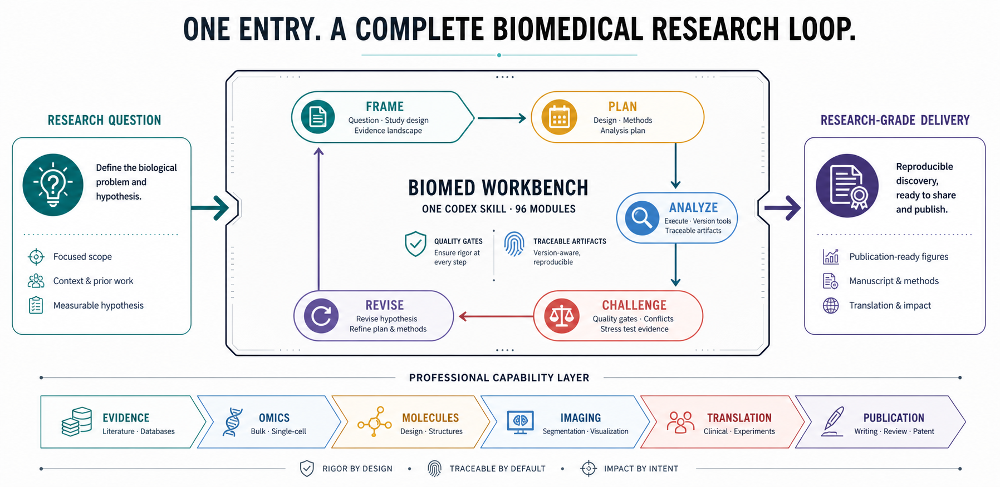

<p align="center">
  
</p>

<h1 align="center">Biomed Workbench</h1>

<p align="center"><strong>A Codex-native biomedical research assistant for evidence, analysis, review, and scientific delivery.</strong></p>

<p align="center">
  <a href="README.md">中文</a> · <a href="README.en.md">English</a>
</p>

<p align="center">
  <a href="https://github.com/JunyanKang/biomed-workbench/actions"></a>
  <a href="LICENSE"></a>
  
  
</p>

<p align="center">
  
</p>

Biomed Workbench is an independent Codex plugin for biomedical research. It gives Codex one disciplined research interface: the user describes a scientific problem, and the workbench routes the request through registered scientific modules, staged research plans, compatibility contracts, quality gates, and publication-facing delivery checks.

The goal is not to expose a pile of scripts. The goal is to help Codex behave like a rigorous biomedical research assistant: frame the question, inspect the available evidence, choose a scientifically coherent workflow, preserve uncertainty, reject unsupported claims, and prepare outputs that can be audited by another researcher.

## Why It Exists

Modern biomedical projects rarely fit into one tool. A real task may start with literature and public database evidence, move through omics or single-cell analysis, connect molecular or structural interpretation, challenge the statistical design, and end as a figure, manuscript, response matrix, patent disclosure, or presentation package.

Biomed Workbench treats that as one research program. It keeps one Codex-facing entrypoint, while the registry behind it can compose a single module, a serial workflow, parallel evidence branches, or a mixed dependency graph.

## Research Loop

1. **Frame:** define the biological question, experimental unit, available evidence, and decision criteria.
2. **Plan:** select the smallest scientifically complete set of modules and dependencies.
3. **Analyze:** run or adapt compatible templates against real project inputs.
4. **Challenge:** inspect assumptions, confounding, missing metadata, failed gates, and contradictory evidence.
5. **Revise:** update the hypothesis or workflow when the evidence does not support the current path.
6. **Deliver:** produce interpretable results, figures, methods, reviews, response matrices, patent or presentation materials with unresolved limits visible.

The workbench does not turn a successful command into a scientific conclusion. Outputs enter project evidence only after the relevant contracts and quality gates are satisfied.

## Capability Areas

| Area | What it coordinates |
| --- | --- |
| [Evidence and literature](docs/capabilities/evidence-and-literature.md) | NCBI, UniProt, Ensembl, dbSNP, gnomAD, HPO, GO, Reactome, cBioPortal, Open Targets, Crossref, Europe PMC, bioRxiv, PubChem, ClinicalTrials.gov, RCSB PDB, AlphaFold, source freshness, citation and claim checks |
| [Omics and single-cell](docs/capabilities/omics-and-single-cell.md) | FASTQ/BAM/VCF/BED/expression workflows, peak and motif analysis, NMF, GWAS fine mapping, single-cell QC, droplet and doublet review, donor-aware inference, integration, annotation, communication, trajectory, RegVelo, multimodal and spatial analysis |
| [Molecular and structural biology](docs/capabilities/molecular-and-structural.md) | Sequence inspection, ORFs, PCR primers, specificity screening, CRISPR, restriction and Golden Gate design, structure evidence, coordinate quality, structure comparison, docking review, chemical filtering |
| [Clinical and experimental research](docs/capabilities/clinical-and-experimental.md) | Cohorts, survival, biomarker performance, adverse events, clinical boundaries, flow cytometry, qPCR, growth curves, dose response, Western blot, biodistribution, xenografts, stability and assay interpretation |
| [Imaging and visualization](docs/capabilities/imaging-and-visualization.md) | Image profiling, segmentation, colocalization, tracking, quantitative review, scientific figures and molecular visualization |
| [Publication and translation](docs/capabilities/publication-and-translation.md) | Figure specifications, manuscript and citation audit, reviewer assessment, response matrix, revision lineage, patent readiness, method flowcharts and presentation delivery |

See the full capability map in [English](docs/capabilities/README.md) or [Chinese](docs/capabilities/README.zh-CN.md).

## Single-Cell And Omics Depth

Single-cell projects can be planned as complete research programs rather than isolated preprocessing steps. The workbench can coordinate raw input validation, ambient RNA and doublet review, Scanpy or Seurat foundation workflows, batch and generative integration, conservative annotation, donor-aware inference, marker validation, trajectory, RNA velocity, fate mapping, cell communication, SCENIC/SCENIC+, RegVelo, RNA+ATAC, CITE-seq, WNN, MOFA+, peak calling, chromVAR and spatial transcriptomics.

The plan remains non-evidentiary until Codex inspects the user's actual files, adapts the relevant templates in the project workspace, records observed versions, reloads outputs, and admits only results that pass the module-specific gates.

## Use In Codex

After installation, start a new Codex task and describe the scientific goal naturally. Users do not need to know internal module names.

Example requests:

> Compare the literature, gene, variant, pathway, structure and trial evidence for TP53. Identify disagreements, missing evidence, and the next decisive analyses.

> Plan and analyze this donor-aware single-cell and spatial study from input validation through artifact review, annotation, multimodal integration, communication, trajectory, regulatory analysis, hypothesis revision, and manuscript-ready delivery.

> Review this molecular design package from sequence and structure quality through primer specificity, CRISPR design, docking-pose checks, chemical filters, and experimental validation planning.

See the usage guide in [English](docs/using-biomed-workbench.md) or [Chinese](docs/using-biomed-workbench.zh-CN.md).

## Install

Add the GitHub repository as a Codex marketplace and install the plugin:

```bash
codex plugin marketplace add JunyanKang/biomed-workbench --ref main
codex plugin add biomed-workbench@biomed-workbench
codex plugin list
```

Then open a new Codex task so the `biomed-workbench` skill is loaded. Installation and update details are available in [English](docs/installation.md) and [Chinese](docs/installation.zh-CN.md).

## Documentation

- Capability map: [English](docs/capabilities/README.md) · [Chinese](docs/capabilities/README.zh-CN.md)
- Usage guide: [English](docs/using-biomed-workbench.md) · [Chinese](docs/using-biomed-workbench.zh-CN.md)
- Installation and updates: [English](docs/installation.md) · [Chinese](docs/installation.zh-CN.md)
- Reproducibility and compatibility: [English](docs/reproducibility.md) · [Chinese](docs/reproducibility.zh-CN.md)
- [Public-data acceptance cases](docs/cases/README.md)
- [Capability maturity and evidence](docs/maturity.md)
- [Architecture and module extension](docs/architecture.md)
- [Format contracts](docs/format-contracts.md)
- [Development and release](docs/development.md)

## Scope And Trust

Biomed Workbench is a research assistant, not an infrastructure manager, clinical decision system, legal advisor, or source of automatic scientific truth. It does not vendor external research repositories, dispatch into local development worktrees, or require private development artifacts at runtime.

New scientific methods are added through the module contract: a manifest, input and output artifacts, compatibility policy, templates, quality gates, tests, and documentation. The user-facing entrypoint remains `biomed-workbench`, so the assistant can keep routing future capabilities through the same research loop.

Published reports in [`reports/`](reports/) summarize release-safe compatibility evidence, public-database checks, template coverage, installation verification, and public-data acceptance cases. Optional credentials are supplied outside the repository and are never embedded in module code, reports, examples or research artifacts.

Licensed under [Apache-2.0](LICENSE).
