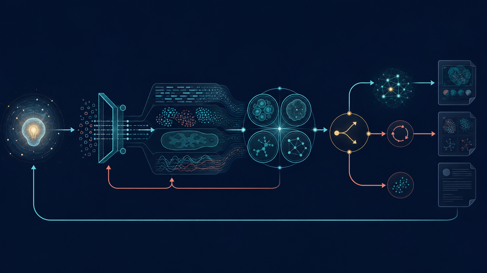
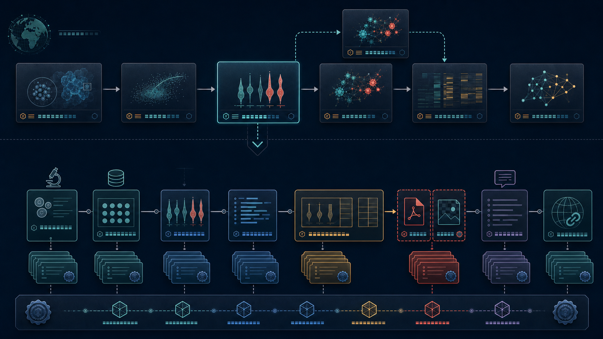
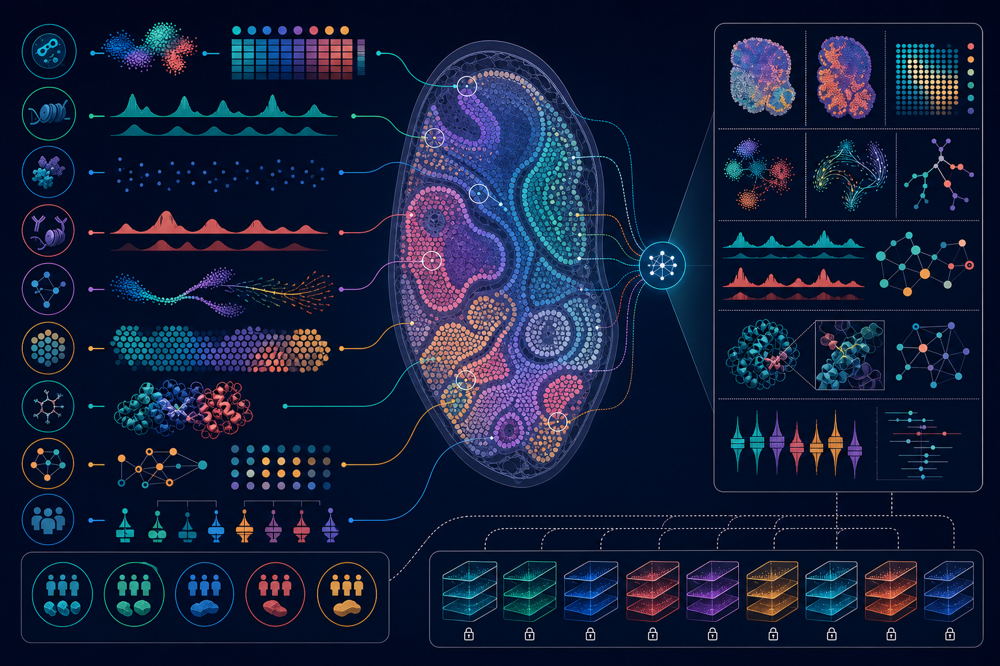

  

<h1 align="center">Biomed Workbench</h1>

<strong>Compile biomedical questions into executable, reviewable, evolving chains of scientific evidence</strong>

  A biomedical research orchestration platform for Codex 
  Evidence · Analysis · Scientific Review · Publication

  <a href="README.md">中文</a> · <a href="README.en.md">English</a>

  
  
  
  
  

  

Conceptual illustration: multimodal inputs move through scientific orchestration, quality review, and provenance tracking into research deliverables. Visual elements are illustrative, not experimental observations.

What ambitious research lacks is rarely one more isolated tool. The harder problem is scientific continuity: how a question is decomposed, why a method is admitted, whether data support inference, how results survive technical and biological review, and which next step can genuinely change the state of knowledge.

Biomed Workbench brings that continuity into Codex. Researchers describe an objective in natural language; the workbench coordinates evidence retrieval, omics, single-cell and spatial analysis, molecular design, quantitative experiments, scientific figures, and publication—while maintaining explicit dependencies, quality gates, and a versioned scientific evidence map.

The result is a research system built to answer four durable questions:

- **Why this analysis:** rationale, competing hypotheses, experimental unit, and decision criterion.
- **How it was performed:** official method sources, input/output contracts, parameter rationale, applicable designs, and verified compatibility combinations.
- **What the result supports:** technical, statistical, biological, and robustness review.
- **What happens next:** retain, retain with caveat, rerun, switch method, acquire data, revise the hypothesis, or stop the branch.

## A project, not a command sequence

One entry point interprets the complete research objective and selects the smallest scientifically sufficient set of registered capabilities. Independent questions may be tested in parallel, dependent analyses execute in order, and every reviewed route remains available to guide the next decision.

  

Conceptual illustration: every branch moves through admission, execution, four-part scientific review and an explicit decision. Retained evidence supports downstream work; revision and new data re-enter the cycle.

Every analysis node defines method fit, adjustable parameters, alternatives, and falsification criteria before execution. Every artifact receives scientific review before it supports a conclusion. Computational success is a process state; evidentiary strength still depends on design, quality, and interpretive scope.

## The scientific evidence map

Research changes as new data, methods, and judgments arrive. Biomed Workbench preserves that evolution at two readable levels:

1. a **project story map** showing only the consequential dependencies among figures and data results;
2. a **result-level evidence map** expanding prior conclusions, registered data, plot-ready data, analysis scripts, figure composition, final PDF/PNG files, captions, narrative sources, and DOI records.

Each file carries a clickable workspace-relative path, media type, and a verification fingerprint. A structured relationship record is released with the map for automated checking, and bilingual reports can only render from a validated map. Version numbers, parent-version fingerprints, and immutable version directories preserve the lineage of scientific interpretation.

  

Conceptual illustration: the upper layer carries the project story; the lower layer traces one result through its complete artifact lineage. Formal relationships live in the validated evidence map and its structured relationship record.

Read the complete design in [Scientific Evidence Map](docs/scientific-evidence-map.md).

## From molecules to tissue, from data to argument

The current registry contains **194 scientific modules**. Registration means that a scientific contract exists; the observed acceptance surface is defined separately by the backend, version, dataset, and reloaded artifacts recorded in each public-data case.

| Research layer | Representative released capabilities |
| --- | --- |
| [Evidence, databases, and literature](docs/capabilities/evidence-and-literature.md) | NCBI, UniProt, Ensembl, gnomAD, HPO, GO, Reactome, Open Targets, Europe PMC, Crossref, bioRxiv, ClinicalTrials.gov, source freshness, citation and claim review |
| [Bulk measurements](docs/capabilities/bulk-sequencing-assays.md) | bulk RNA-seq; ChIP-seq, CUT&RUN and CUT&Tag; R-loop mapping by DRIP-seq/DRIPc-seq, qDRIP-seq, R-ChIP or MapR; RIP-seq, eCLIP and LACE-seq; Ribo-seq with multiple ORF callers; GRO-seq, PRO-seq, TT-seq and NET-seq; ATAC-seq, DNA methylation, 3D genome and RNA-modification enrichment |
| [Single-cell measurements, trajectories, and integration](docs/capabilities/single-cell-integration-reference-cross-species.md) | Scanpy/Seurat, scVI/scANVI, Harmony, CCA/RPCA, FastMNN, scIB, WNN and MOFA+; MultiVI accepted on public PBMC multiome data; SAMap accepted on the public Hydra–planarian case |
| [Spatial measurements](docs/capabilities/trajectory-spatial-complete-analysis.md) | Visium and Xenium data structures; Xenium–SpatialData–Squidpy image/segmentation analysis; RCTD accepted on Slide-seq and Tangram on public data; PASTE slice alignment and three-dimensional coordinates |
| [Universal analysis and project methods](docs/capabilities/omics-and-single-cell.md) | format validation, sample design, differential testing, DEqMS, GO/KEGG, GSEA, WGCNA, motifs, networks, evidence review and visualization specifications that can serve several measurement scales |
| [Molecular and structural biology](docs/capabilities/molecular-and-structural.md) | Sequence and ORF analysis, PCR, CRISPR, cloning design, structure quality, comparison, docking review, chemical filtering, validation design |
| [Clinical and experimental research](docs/capabilities/clinical-and-experimental.md) | Cohort and survival analysis, biomarkers, flow cytometry, qPCR, dose response, western blot, biodistribution, xenograft, stability and quantitative assays |
| [Imaging and scientific visualization](docs/capabilities/imaging-and-visualization.md) | Image profiling, segmentation, colocalization, tracking, tissue-image registration, unified figure specifications, multi-part figure composition and visual QA |
| [Publication and translation](docs/capabilities/publication-and-translation.md) | Versioned standards for 54 journals, project-to-journal fit, article-structure and limit review, figure specifications, manuscript review, citation audit, reviewer simulation, response matrices, revision lineage, patent preparation and presentations |

  

Conceptual illustration: sample-aware modalities are coordinated across cellular and tissue scales. Distributions, structures, and tissue morphology are schematic.

Explore the full capability map: [中文](docs/capabilities/README.zh-CN.md) · [English](docs/capabilities/README.md).

## Rigor as a runtime property

- **Experimental units first.** Condition-level inference returns to donors, samples, animals, organoids, or independently prepared specimens.
- **Raw evidence preserved.** Single-cell and multimodal integration retains raw counts; differential inference uses the statistical level appropriate to the design.
- **Parameters justified.** Defaults are candidates. Consequential settings are selected from observed data, official APIs, method papers, and sensitivity results.
- **Quality gates govern delivery.** Results enter formal conclusions and downstream analyses only after satisfying declared input, execution, statistical, and biological criteria.
- **The full research trajectory remains visible.** Supporting, weakening, conflicting, and pending evidence stays in the event ledger so every method revision has a reviewable rationale.
- **Artifacts are re-verifiable.** Actual software versions, seeds, parameters, code, and checksums accompany results; serialized objects are reloaded before delivery.
- **Figures and prose share a source.** Figure elements, captions, results text, and DOI records derive from the same validated evidence map.

## Current observed execution baseline

The release distinguishes a parameterized contract from an observed scientific run. The following entry points executed their external workflows and reopened native outputs before temporary data were removed.

| Entry point | Current observed acceptance |
| --- | --- |
| ATAC-seq and DNase-seq | ENCODE `ENCSR356KRQ` and `ENCSR000EOT`, each retaining two biological replicates; complete ENCODE ATAC 2.2.3 peak, signal, and QC outputs reloaded |
| Ribo-seq, GRO/PRO-seq, iCLIP, WGBS, and Hi-C | Pinned nf-core/riboseq 1.2.0, nascent 2.3.0, clipseq 1.0.0, methylseq 4.2.0, and hic 2.1.0 runs with 174, 50, 22, 52, and 14 scientific files reloaded, respectively |
| NET-seq | Public `SRR12840066` against sacCer3; UMI/adapter handling, unique alignment, BAM, and strand-specific end tracks executed and reloaded |
| RIP-seq | RIPSeeker 1.28.0 official PRC2 data; two RIP libraries and one control; two fixed-seed executions produced byte-identical 59-region and native-R outputs |
| LACE-seq | Public Ago2 `SRR10173391` and IgG `SRR10173407`; Cutadapt 1.15, Bowtie 1.2.3, rRNA filtering, whole-read IgG subtraction, and strand-aware cluster calling executed |
| Tangram | Complete test pair from a pinned Tangram repository commit; 26,431 reference cells, 18 cell classes, 9,852 spatial locations, and 249 shared genes; native mapping model and normalized projection reloaded |

Evidence renewal follows the class of change. Scientific implementation, parameter semantics, input handling, or output recognition changes require recomputation; runtime-policy changes require targeted compatibility retesting; module metadata changes require reviewed scope reissue; documentation or unrelated global-registry changes do not invalidate a run produced by the same executor. The current machine decision is recorded in [`reports/scientific-evidence-revalidation.json`](reports/scientific-evidence-revalidation.json).

## Start in Codex

After installation, describe the project objective directly. Researchers do not need to memorize module IDs or assemble internal skills.

> Build a donor-aware single-cell and spatial research program from the raw data and sample design. Compare integration, annotation, deconvolution, trajectory, and communication strategies; define method rationale, quality gates, figure plans, and decision criteria at every stage.

> Design a CUT&Tag study in which S9.6 is the declared target. Evaluate whether an internal reference is justified for normalization and use RNase H-treated material as specificity evidence. Then perform peak analysis, differential testing, GO/KEGG, GSEA, WGCNA, and transcriptional linkage.

> Design a Ribo-seq study with explicit periodicity and P-site quality gates. Compare Ribo-TISH and Ribotricer for translated-ORF discovery, register caller agreement and disagreement, and keep RNA-seq-based expression analysis separate from translation evidence.

> Build an evidence map for TP53 across literature, genes, variants, pathways, structures, and clinical trials. Separate direct evidence, association, conflict, and knowledge gaps, then propose the experiment most likely to change the current judgment.

The workbench inspects real project files and experimental design before compiling a plan, executing applicable modules, reviewing artifacts, and recommending the next decision. See [Using Biomed Workbench](docs/using-biomed-workbench.md).

## Installation

Ask Codex or another compatible agent to install the Biomed Workbench plugin from the `JunyanKang/biomed-workbench` GitHub repository, verify the installed version and module registry, and open a new task so the current entry point is loaded. The agent should report the exact version, validation result, and any unmet runtime dependency in plain language. Details: [中文](docs/installation.zh-CN.md) · [English](docs/installation.md).

## Data access and credentials

Credential requirements are audited at the endpoint level, not inferred from the number of databases. The public endpoints currently implemented for Crossref, Europe PMC, ClinicalTrials.gov, UniProt, Ensembl, Reactome, Open Targets, cBioPortal, PubChem and related resources do not require an API key. `NCBI_API_KEY` is optional for the implemented NCBI E-utilities and Datasets requests and raises service capacity; private cBioPortal deployments and paid Crossref services have separate authentication models that are not silently reused by public modules.

A researcher may simply ask an agent to “configure my NCBI API key.” The agent uses hidden input, reports only whether the credential is available and where it is stored, and keeps the value outside Git, project artifacts, logs, reports, and evidence maps. Task-scoped environments and institutional secret managers remain available for clusters and managed infrastructure. See [中文](docs/data-access-and-credentials.zh-CN.md) · [English](docs/data-access-and-credentials.md).

## Documentation

- Scientific evidence maps and bilingual reports: [中文](docs/scientific-evidence-map.zh-CN.md) · [English](docs/scientific-evidence-map.md)
- Capability map: [中文](docs/capabilities/README.zh-CN.md) · [English](docs/capabilities/README.md)
- Usage: [中文](docs/using-biomed-workbench.zh-CN.md) · [English](docs/using-biomed-workbench.md)
- Installation: [中文](docs/installation.zh-CN.md) · [English](docs/installation.md)
- Data access and credentials: [中文](docs/data-access-and-credentials.zh-CN.md) · [English](docs/data-access-and-credentials.md)
- Journal standards and manuscript review: [中文](docs/journal-standards.zh-CN.md) · [English](docs/journal-standards.md)
- Reproducibility: [中文](docs/reproducibility.zh-CN.md) · [English](docs/reproducibility.md)
- Public-data validation cases: [中文](docs/cases/README.zh-CN.md) · [English](docs/cases/README.md)
- Maturity and evidence levels: [中文](docs/maturity.zh-CN.md) · [English](docs/maturity.md)
- Architecture and extension: [中文](docs/architecture.zh-CN.md) · [English](docs/architecture.md)
- Format contracts: [中文](docs/format-contracts.zh-CN.md) · [English](docs/format-contracts.md)
- Development and release: [中文](docs/development.zh-CN.md) · [English](docs/development.md)

## Research integrity

Biomed Workbench calibrates conclusion strength to evidence level, preserves scientific context in replayable project state, and records interpretive change through version lineage. Exploratory findings retain their exploratory status; clinical, ethical, patent, and regulatory decisions enter the appropriate professional review; public deliverables carry the scientific information needed for reproducibility and suitable for release.

New methods join the system as independent modules with declared artifact contracts, tool and format compatibility, parameter surfaces, quality gates, validation evidence, and maturity. The entry point remains stable while the research capability graph continues to evolve.

Release-safe compatibility evidence, execution-readiness audits, and public-data cases are available in [`reports/`](reports/).

License: [Apache-2.0](LICENSE).
