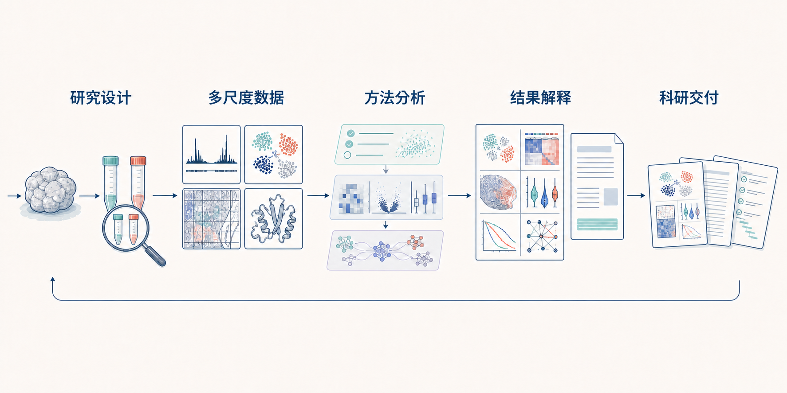

<h1 align="center">Biomed Workbench</h1>

<strong>把研究问题、数据分析与科研表达连成一条完整路径</strong>

从组学、空间与结构数据，到科学解释、研究写作和科研交付

<a href="README.md">中文</a> · <a href="README.en.md">English</a> ·
<a href="#开始使用">开始使用</a> ·
<a href="docs/capabilities/README.zh-CN.md">完整能力</a> ·
<a href="docs/releases/README.zh-CN.md">发布记录</a>

概念图：研究设计与不同尺度的数据进入同一分析过程，经结果解释形成科学图件、研究文本和后续研究方案；图中内容不代表真实实验结果。

Biomed Workbench 把经过登记的分析方法、项目数据、科学判断与发表交付连接起来。你可以直接描述科学问题、实验设计、已有数据和希望得到的结果，它会先判断证据能回答什么，再组织足够而不过量的方法、分析步骤和交付形式。

它既能处理一项明确的分析，也能协调由多种数据、实验和写作任务组成的长期项目。具备执行条件的方法会运行并重新读取实际输出；尚未执行、只完成受控测试、只在公共案例中验证或已经被当前项目采用，都会分别说明。

## 从一个研究问题开始

| 理解项目 | 完成分析 | 形成成果 |
| --- | --- | --- |
| 识别研究对象、实验单位、分组、对照、数据类型、假说和真正需要回答的问题。 | 选择足以回答问题的方法组合，衔接上下游步骤，并结合实际结果判断是否需要补充分析。 | 把数据、表格和图件组织成科学解释、后续实验、论文段落、项目申请或汇报材料。 |

你不需要把任务拆成软件命令。工作台会区分实验类型、靶标、内部参照、特异性处理和归一化，也会识别哪些分析可以并行、哪些结果必须先完成才能进入下一步。对于同一个问题，它优先选择能够改变科学判断的必要分析，避免为了“方法更多”而不断增加计算。

## 它能完成哪些研究工作

### 数据与研究对象

| 研究方向 | 可以开展的工作 |
| --- | --- |
| [Bulk 测序](docs/capabilities/bulk-sequencing-assays.zh-CN.md) | 先核对原始测序文件、样本表、软件和参考资源，再开展 RNA 表达、RNA 加工与可变剪接，染色质结合与开放性，R-loop、蛋白–RNA 结合、翻译、瞬时转录、甲基化和三维基因组分析 |
| [Single-cell](docs/capabilities/single-cell-integration-reference-cross-species.zh-CN.md) | 质控与注释，跨批次和参考整合，多组学联合分析，轨迹与状态转变，调控网络、样本感知推断及跨物种映射 |
| [Spatial](docs/capabilities/trajectory-spatial-complete-analysis.zh-CN.md) | 平台数据导入与质控，组织图像和细胞分割，空间域、解卷积、参考投射、空间通讯、多切片对齐与三维组织分析 |
| [分子与结构生物学](docs/capabilities/molecular-and-structural.zh-CN.md) | 蛋白互作网络，AlphaFold 结果接收与质量解读，HADDOCK3 对接，结构比较、结合评估和结构证据作图 |
| [临床与实验研究](docs/capabilities/clinical-and-experimental.zh-CN.md) | 队列、生存、标志物和定量实验分析，以及流式、qPCR、剂量反应、蛋白定量、微生物学和动物实验设计 |
| [定量图像分析](docs/capabilities/quantitative-imaging.zh-CN.md) | 图像检查、分割、共定位、目标追踪、迁移定量和基础配准，并输出逐目标测量数据与质量结果 |

### 贯穿全项目的支撑能力

| 研究工作 | 可以开展的工作 |
| --- | --- |
| [文献与公共数据库](docs/capabilities/evidence-and-literature.zh-CN.md) | 多来源文献检索与全文阅读，引用核查，以及遗传关联、表达、组学数据集、基因、变异、通路、结构、药物和临床试验证据整合 |
| [跨尺度通用分析](docs/capabilities/omics-and-single-cell.zh-CN.md) | 实验设计、差异分析、蛋白组定量、功能富集、GSEA、WGCNA、motif、网络分析和跨数据结果整合 |
| [科学作图规范与图件交付](docs/capabilities/scientific-figure-standards.zh-CN.md) | 根据分析目的选择图形，统一字体、线条、颜色、图例和统计标注，并交付作图数据、PDF、SVG 与高分辨率 PNG |
| [科研写作、发表与转化](docs/capabilities/publication-and-translation.zh-CN.md) | 全文中英对照精读，论文和科研项目申请写作，学术表达修订，期刊定位、统计与数据可用性检查、审稿回复、汇报和专利材料 |

[查看完整能力地图](docs/capabilities/README.zh-CN.md) · [查看公共案例](docs/cases/README.zh-CN.md)

## 一个项目如何向前推进

1. **先理解研究。** 读取样本设计、已有文件和前期结论，明确当前问题、比较单位、竞争性解释和期望交付物。
2. **再选择方法。** 根据数据和问题安排主分析、必要验证及上下游关系，而不是按关键词简单匹配工具。
3. **结合结果解释。** 重新打开真实输出，优先说明效应大小、不确定性、实验单位和阴性或不一致结果；再结合技术质量、研究设计和生物学背景修正结论，并提出能够区分竞争性解释的下一步。
4. **决定下一步。** 保留能够支撑当前结论的结果，调整不合适的分析，并把下一项计算、实验或写作任务接在已有研究基础上。

项目可以在三种节奏之间切换：探索阶段用于快速检视候选结果和尝试图形；定稿阶段开始固定统计单位、参数、作图数据和正式脚本；投稿准备阶段才执行完整复现、视觉检查以及公开文件的完整性检查。已有项目不需要从空白状态重建，工作台可以只读扫描现有目录，提出“图—作图数据—分析脚本—排图程序—图注”的候选关系，待研究者确认后再纳入项目。

物种、组织、发育阶段、疾病状态和细胞区室等领域背景可以按项目登记。文献支持的已有认识与当前项目观察分别保存，并同步记录不能跨越的推断、其他可能解释以及能够区分这些解释的后续观察，使领域知识参与复核而不被当成自动成立的结论。

默认结果页只回答五件事：当前生物学问题、主要观察与效应方向、证据支持到哪里、结果进行到哪一步、下一步怎样决定。运行环境、文件版本、结果来源和详细过程保留在可复现性记录中，只有在阻断结果解释或用户主动查看时才展开。

长期项目中已经确定的样本信息、参考版本、细胞注释、统计单位、分析环境、颜色和正式图件会持续沿用。再次运行同一分析前，工作台会先核对已有的 Conda 或其他运行环境，内容一致时直接复用，发生漂移时先停止计算并说明需要恢复原环境还是建立新的分析分支。数据、作图表格、图件、图注、正文和文献来源可以连接到同一份[科学证据地图](docs/scientific-evidence-map.zh-CN.md)，让多轮分析之后仍能看清每个结论从哪里来。每个版本同时生成带目录的中英文 HTML 报告和证据地图，可直接跳转到登记数据、分析程序、最终图件、图注与原始研究；Markdown 和机器可读文件继续保留。冲突或阴性结果不会被藏起来，而会与支持性结果一起用于决定课题应继续、调整还是补充验证。

## 研究主线如何贯穿不同能力

工作台的重点不是把工具简单集中在一起，而是让每项能力在同一条研究主线上承担清楚的任务：文献与数据库帮助界定已知和未知，组学与实验分析产生可复核的观察，生物学解释检查证据边界和竞争性机制，科学作图与写作再把经过复核的结果组织成递进的成果。

| 研究层面 | 关键作用 |
| --- | --- |
| 科学问题与研究设计 | 明确实验单位、比较关系、核心假说、替代解释和能够改变判断的结果 |
| 方法选择与实际执行 | 按实验方法、靶标、对照、归一化和生物学关系选择最小充分分析，并重新读取真实输出 |
| 生物学解释与修正 | 结合效应量、不确定性、阴性结果和领域背景修正主张，决定保留、重做、替换或停止 |
| 研究故事与图表 | 让每个图面分别承担发现、来源、机制一致性、验证、边界或整合任务，减少重复展示 |
| 论文与研究交付 | 让图、图注、正文、引用和后续研究方案使用同一组经过复核的项目事实 |

这套逻辑已经落实到复杂语义解析、最小充分分析、既有项目导入、三种工作节奏、领域背景复核、结果解释自我修正、论文图任务分配和视觉语义比较中。具体说明见[科学解释、研究叙事与结果决策](docs/capabilities/scientific-interpretation-and-storytelling.zh-CN.md)。

## 论文写作与科研交付

写作不是分析结束后的文字包装。工作台先核对项目事实、数据、图表和参考文献，再按照论文、科研项目申请、审稿回复、汇报或专利材料的用途组织内容；证据不足的部分保留为待补信息、限制或待检验假说。

- **论文与报告：** 从主张—证据关系出发组织题目、摘要、Results、Discussion、方法、图注和双语解读报告；写前识别表达与证据问题，写后核对数字、结果、引用、术语和结论强度均未改变。
- **科研项目申请：** 根据资助机构、申请年度、项目定位和正式模板建立论证重点，衔接立项依据、科学假说、研究方案、技术路线与前期基础；完成中英文摘要后，在保留科学内容与可行性依据的前提下，把全文修订为自然、严谨的生命科学语言。
- **科学图件：** 让数据图、机制示意图和研究路线图分别承担明确任务，交付可编辑源文件，并复核最终尺寸下的文字、图层、对齐和页面边界。
- **发表与修订：** 结合目标期刊要求检查结构、统计报告、引用、数据可用性，并组织审稿意见、逐条回复和稿件修改记录。

详细说明见[科研写作、发表与转化交付](docs/capabilities/publication-and-translation.zh-CN.md)、[科研项目申请书研究与写作](docs/capabilities/nsfc-proposal-writing.zh-CN.md)和[期刊定位与稿件规范](docs/journal-standards.zh-CN.md)。

## 你可以直接这样使用

> 根据原始数据和样本设计，建立 donor-aware 的单细胞与空间研究方案；完成质控、整合、注释、解卷积和轨迹分析，并说明每一步如何影响后续科学判断。

> 为 CUT&Tag 研究建立完整流程，把靶标、抗体、内部参照、特异性处理和归一化作为设计参数；完成 peak、差异、富集、网络和转录关联分析，并统一输出图表。

> 围绕一个候选机制整合文献、公共数据库、组学、蛋白互作和结构证据；区分直接证据、关联、冲突和知识缺口，再提出最能改变当前判断的实验。

> 根据项目数据、图表、分析记录和参考文献完成论文结构、Results 和 Discussion 初稿；检查统计、引用、图注、目标期刊要求和数据可用性，并列出仍需作者确认的内容。

## 开始使用

在 Codex 中直接说：

> 安装 [JunyanKang/biomed-workbench](https://github.com/JunyanKang/biomed-workbench) 这个仓库的当前发布版本；保护已有本地文件，完成安装后检查插件并重新加载。

安装完成后，开启一个新的研究任务，说明：

- 你希望回答的科学问题；
- 样本、分组、对照和实验设计；
- 已有数据、文件或前期结果；
- 希望得到的分析、图件、文字或后续实验方案。

详见[使用指南](docs/using-biomed-workbench.zh-CN.md)和[安装说明](docs/installation.zh-CN.md)。

当前发布版本以 Codex 为主要使用环境。其他支持 Agent Skills 或本地标准输入输出 MCP 的智能体也可以读取研究入口和能力信息，但需要具备自己的文件访问、流程执行和结果读取能力；具体方式见[其他智能体接入说明](docs/agent-integration.zh-CN.md)。

## 进一步阅读

| 想了解什么 | 中文 | English |
| --- | --- | --- |
| 如何使用与准备数据 | [使用指南](docs/using-biomed-workbench.zh-CN.md) · [格式与数据要求](docs/format-contracts.zh-CN.md) | [Using the workbench](docs/using-biomed-workbench.md) · [File and data requirements](docs/format-contracts.md) |
| 能力、案例与适用范围 | [能力地图](docs/capabilities/README.zh-CN.md) · [公共案例](docs/cases/README.zh-CN.md) · [成熟度说明](docs/maturity.zh-CN.md) | [Capability map](docs/capabilities/README.md) · [Public cases](docs/cases/README.md) · [Maturity](docs/maturity.md) |
| 长期项目与结果来源 | [科学解释与研究叙事](docs/capabilities/scientific-interpretation-and-storytelling.zh-CN.md) · [项目组织与工作模式](docs/project-governance.zh-CN.md) · [科学证据地图](docs/scientific-evidence-map.zh-CN.md) · [可复现性](docs/reproducibility.zh-CN.md) | [Scientific interpretation and research story](docs/capabilities/scientific-interpretation-and-storytelling.md) · [Project organisation and working modes](docs/project-governance.md) · [Scientific evidence map](docs/scientific-evidence-map.md) · [Reproducibility](docs/reproducibility.md) |
| 数据库、写作与期刊 | [公共数据库与凭据](docs/data-access-and-credentials.zh-CN.md) · [科研写作](docs/capabilities/publication-and-translation.zh-CN.md) · [期刊规范](docs/journal-standards.zh-CN.md) | [Data access and credentials](docs/data-access-and-credentials.md) · [Academic writing](docs/capabilities/publication-and-translation.md) · [Journal requirements](docs/journal-standards.md) |
| 版本与开发扩展 | [发布记录](docs/releases/README.zh-CN.md) · [开发说明](docs/development.zh-CN.md) | [Release notes](docs/releases/README.md) · [Development](docs/development.md) |

Biomed Workbench 采用 [Apache-2.0](LICENSE) 许可，相关来源说明见[第三方声明](THIRD_PARTY_NOTICES.md)。不同能力的实际执行范围会随输入数据、研究设计、软件环境和对应版本的验证情况而变化，开始项目前可在能力文档和发布记录中查看当前说明。
