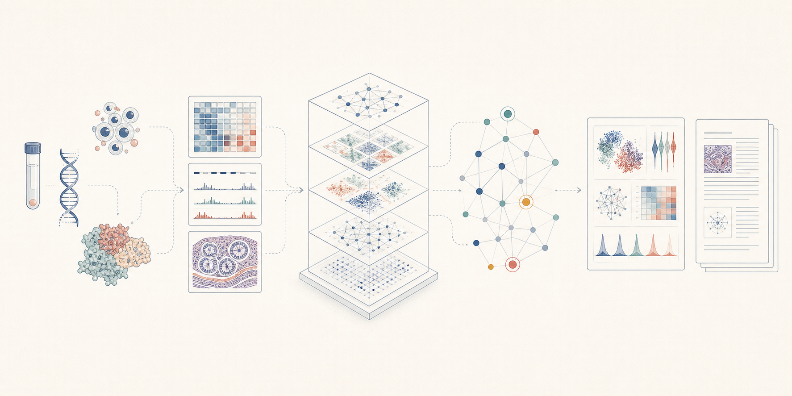

<h1 align="center">Biomed Workbench</h1>

<strong>让生物医学研究从问题出发，以可复核的证据收束</strong>

  研究设计 · 数据分析 · 科学评审 · 证据追溯 · 论文交付

  <a href="README.md">中文</a> · <a href="README.en.md">English</a>

  
  

  <a href="#开始使用">开始使用</a> ·
  <a href="docs/capabilities/README.zh-CN.md">能力地图</a> ·
  <a href="docs/scientific-evidence-map.zh-CN.md">证据地图</a> ·
  <a href="docs/releases/README.zh-CN.md">发布记录</a>

  

概念图：展示研究输入、分析、评审、证据组织与交付之间的关系；图中数据与图形均为示意，不代表实验结果。

Biomed Workbench 把生物医学研究设计、数据分析和科研交付连接起来。它将研究问题、真实数据、方法选择、分析结果、科学评审和后续决策放在同一套可追溯记录中，使一次分析能够成为下一步研究判断的可靠依据。

用户以自然语言描述目标、研究设计与已有数据；工作台检查输入和方法适用条件，选择相应能力，执行可用流程，重新打开结果文件，并把结论限定在实际证据能够支持的范围内。

| 研究设计 | 证据追溯 | 科研交付 |
| --- | --- | --- |
| 先界定问题、实验单位、假设与决策标准，再组织方法。 | 把数据、参数、程序、图件、图注、引用和评审连接起来。 | 从分析表格和图组延伸到双语报告、稿件、回复与演示材料。 |

## 一个项目如何推进

| 01 · 定义 | 02 · 分析 | 03 · 评审 | 04 · 决策 |
| --- | --- | --- | --- |
| 明确生物学问题、实验单位、已有证据、竞争性假设与成功标准。 | 按输入要求和软件条件组合方法，记录版本、参数、环境与输出。 | 分别检查技术质量、统计稳健性、生物学解释和结论边界。 | 保留、带条件保留、重跑、换方法、补数据、调整假设或停止分支。 |

计算结束不等于分析完成。只有通过质量检查、结果重读和科学评审的内容，才会成为当前项目的有效证据；冲突、失败和被排除的路线仍保留在项目历史中，供后续判断复核。

## 科学证据地图

证据地图采用两层结构，避免把完整文件关系压缩成一张难以阅读的大图：

1. **项目主线**只呈现关键数据和图组之间的支持、削弱、冲突与依赖；
2. **单项证据**再展开前置结论、当前数据、作图数据、分析程序、排版程序、最终文件、图注、解释来源与 DOI。

文件身份、版本关系和内容指纹随同保存。双语解读报告读取同一张经过核对的证据地图，因此图、表、正文与引用共享同一来源，而不是在报告阶段重新拼接。完整设计见[科学证据地图](docs/scientific-evidence-map.zh-CN.md)。

## 覆盖的研究层级

当前包含 **207 个可独立识别的科学模块**。这一数字表示方法用途、输入输出和使用条件已经登记，不等同于每个模块已在所有数据类型、物种或运行环境中完成验收；精确的执行范围与代表性案例以对应版本的[发布记录](docs/releases/README.zh-CN.md)、[成熟度说明](docs/maturity.zh-CN.md)和[`reports/`](reports/)为准。

| 研究层级 | 代表性能力 |
| --- | --- |
| [证据与公共数据库](docs/capabilities/evidence-and-literature.zh-CN.md) | 文献与引用核查，基因、变异、通路、结构和临床试验证据，多来源时效性与主张审查 |
| [Bulk 测序](docs/capabilities/bulk-sequencing-assays.zh-CN.md) | bulk RNA-seq，ChIP-seq、CUT&RUN、CUT&Tag，R-loop mapping，RIP/eCLIP/LACE-seq，Ribo-seq，GRO/PRO/TT/NET-seq，ATAC-seq，甲基化与三维基因组 |
| [Single-cell](docs/capabilities/single-cell-integration-reference-cross-species.zh-CN.md) | 质控与注释，批次和参考整合，多组学整合，轨迹、velocity、调控分析，以及跨物种映射与评估 |
| [Spatial](docs/capabilities/trajectory-spatial-complete-analysis.zh-CN.md) | 平台数据结构与质控，组织图像和分割，空间域、解卷积与参考投射，多切片对齐、三维坐标和空间通讯 |
| [跨尺度通用方法](docs/capabilities/omics-and-single-cell.zh-CN.md) | 实验设计与格式检查，差异检验、DEqMS、GO/KEGG、GSEA、WGCNA、motif、网络分析和统一作图规范 |
| [分子与结构生物学](docs/capabilities/molecular-and-structural.zh-CN.md) | 蛋白互作网络，AlphaFold 结果接收与质量评审，HADDOCK3 对接，结构比较、结合评估和网络交付 |
| [临床与实验研究](docs/capabilities/clinical-and-experimental.zh-CN.md) | 队列、生存、标志物和定量实验；流式、qPCR、剂量反应、蛋白定量、微生物学和动物实验 |
| [成像与科学可视化](docs/capabilities/imaging-and-visualization.zh-CN.md) | 图像检查、分割、共定位、目标追踪、迁移定量、科学图件设计和结构交互视图 |
| [论文与转化交付](docs/capabilities/publication-and-translation.zh-CN.md) | 全文双语精读，科研写作与基金论证，统计和数据可用性审查，期刊定位、引用核查、审稿回复、专利、图件与汇报交付 |

完整能力索引：[中文](docs/capabilities/README.zh-CN.md) · [English](docs/capabilities/README.md)

## 可信度如何进入流程

- **实验单位优先：** 条件比较回到 donor、sample、animal、organoid 或独立制备样本，避免把细胞或技术重复误作生物学重复。
- **方法有使用条件：** 输入、适用场景、可调参数、兼容软件、质量检查和替代方法都有明确说明。
- **原始证据与整合表示分离：** 整合结果服务于表示、映射和可视化；差异推断回到适合研究设计的原始计数与统计单位。
- **结果必须重新读取：** 运行版本、参数、程序和文件核对信息随结果保存，正式交付前重新打开并检查实际文件。
- **结论强度随证据而定：** 探索性结果保持探索性；公共案例、真实服务结果和当前用户项目的科学完成分别记录。
- **图、表和文字同源：** 作图数据、图件、图注、结果段和 DOI 从同一版本的证据地图派生。

## 开始使用

在 Codex 中直接说：

> 安装 [JunyanKang/biomed-workbench](https://github.com/JunyanKang/biomed-workbench) 这个仓库的当前发布版本；核对插件身份、统一研究入口、科学模块注册表和实际版本；保护现有本地修改；完成安装后运行发布完整性检查并重新加载插件。

安装完成后，开启一个新的研究任务，直接描述研究目标、实验设计、已有数据和期望交付物。例如：

> 根据原始数据和样本设计，建立 donor-aware 的单细胞与空间研究方案；比较整合、注释、解卷积、轨迹和通讯策略，并为每一步给出方法依据、质量标准、图表计划和下一步决策条件。

> 为 CUT&Tag 研究建立完整流程，把靶标、抗体、内部参照、特异性处理和归一化作为设计参数；完成 peak、差异、富集、网络和转录关联分析，并保留可复核的证据链。

> 围绕一个候选机制整合文献、公共数据库、组学、蛋白互作与结构证据；区分直接证据、关联、冲突和缺口，再提出最能改变当前判断的后续实验。

详见[使用指南](docs/using-biomed-workbench.zh-CN.md)和[安装说明](docs/installation.zh-CN.md)。

## 在不同智能体中使用

目前，Codex 是经过完整发布流程验证的使用环境。其他支持 Agent Skills 或本地标准输入输出 MCP 的智能体，也可以读取同一个科学入口和模块注册表；但文件访问、运行环境、外部软件调用、结果重读和证据交付仍需由相应智能体分别实现并验证。详见[其他智能体接入说明](docs/agent-integration.zh-CN.md)。

其他智能体不要照搬上面的 Codex 插件安装提示。完整仓库中的 Codex 发布信息可以保留但不加载；使用时应按照该智能体支持的技能或 MCP 方式接入，并说明它实际能够完成哪些步骤。

## 文档索引

| 主题 | 中文 | English |
| --- | --- | --- |
| 使用与安装 | [使用指南](docs/using-biomed-workbench.zh-CN.md) · [安装](docs/installation.zh-CN.md) | [Using the workbench](docs/using-biomed-workbench.md) · [Installation](docs/installation.md) |
| 科学能力 | [能力地图](docs/capabilities/README.zh-CN.md) · [公共案例](docs/cases/README.zh-CN.md) | [Capability map](docs/capabilities/README.md) · [Public cases](docs/cases/README.md) |
| 证据与复现 | [证据地图](docs/scientific-evidence-map.zh-CN.md) · [成熟度](docs/maturity.zh-CN.md) · [可复现性](docs/reproducibility.zh-CN.md) | [Evidence map](docs/scientific-evidence-map.md) · [Maturity](docs/maturity.md) · [Reproducibility](docs/reproducibility.md) |
| 数据访问 | [公共数据库与凭据](docs/data-access-and-credentials.zh-CN.md) | [Data access and credentials](docs/data-access-and-credentials.md) |
| 写作与期刊 | [论文与转化交付](docs/capabilities/publication-and-translation.zh-CN.md) · [期刊定位与稿件规范](docs/journal-standards.zh-CN.md) | [Publication and translation](docs/capabilities/publication-and-translation.md) · [Journal positioning and manuscript requirements](docs/journal-standards.md) |
| 项目结构与扩展 | [架构](docs/architecture.zh-CN.md) · [格式与数据要求](docs/format-contracts.zh-CN.md) · [开发](docs/development.zh-CN.md) | [Architecture](docs/architecture.md) · [File and data requirements](docs/format-contracts.md) · [Development](docs/development.md) |
| 版本 | [发布记录](docs/releases/README.zh-CN.md) | [Release notes](docs/releases/README.md) |

Biomed Workbench 采用 [Apache-2.0](LICENSE) 许可，相关来源说明见[第三方声明](THIRD_PARTY_NOTICES.md)。科学模块、证据模型和发布记录随版本持续演进；新增能力只有在方法定义、实际实现、验证证据和文档保持一致后，才会列入公开能力清单。
